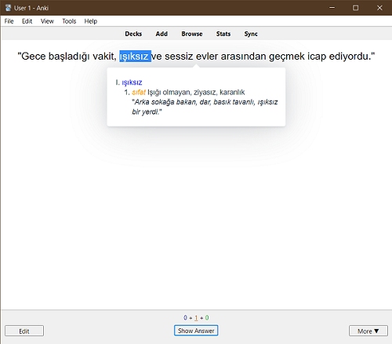

# Turkish Dictionary for Anki


An [Anki](https://apps.ankiweb.net/) add-on to look up Turkish vocabulary and fill notes with information
from the official [TDK dictionary](https://sozluk.gov.tr/).

Currently, the add-on queries word definitions, example sentences, and pronunciations from the dictionary.

The add-on provides an editor button to fill the current note,
and a browser menu item under the Edit menu to fill selected notes in bulk.

It also comes with a template filter named `{{trdict-audio}}` to generate pronunciations
for a field's contents on the fly that can be used by typing something like this in a [card template](https://docs.ankiweb.net/templates/intro.html):

```
{{trdict-audio:Front}}
```

Audio files generated this way are not saved to your notes and synced. Instead they are cached inside the [user_files/audiocache](./src/user_files/readme.txt) folder and preserved after add-on updates.

You can also look up a word by double clicking on it when reviewing:



This works for notetypes specified in the `tooltip_enabled_notetypes` option, which can be modified from **Tools > Add-ons**. You can also assign a shortcut to the `tooltip_shortcut` option to trigger the tooltip from any card. The default is `Alt+Shift+S`.

The add-on works on Anki 2.1.49+.

## Installation

You can download the add-on from AnkiWeb: https://ankiweb.net/shared/info/351090164

## Changelog

See [CHANGELOG.md](CHANGELOG.md) for a list of changes.

## Support & feature requests

Please post any questions, bug reports, or feature requests in the [support page](https://forums.ankiweb.net/t/turkish-dictionary/19629) or the [issue tracker](https://github.com/abdnh/anki-trdict/issues).

If you want priority support for your feature/help request, I'm available for hire.
You can get in touch from the aforementioned pages, via [email](mailto:abdo@abdnh.net) or on [Fiverr](https://www.fiverr.com/abd_nh).

## Support me

Consider supporting me if you like my work:

<a href="https://github.com/sponsors/abdnh"></a>
<a href="https://www.patreon.com/abdnh"></a>
<a href="https://www.buymeacoffee.com/abdnh" target="_blank"></a>

I'm also available for freelance add-on development on Fiverr:

<a href="https://www.fiverr.com/abd_nh/develop-an-anki-addon"></a>
